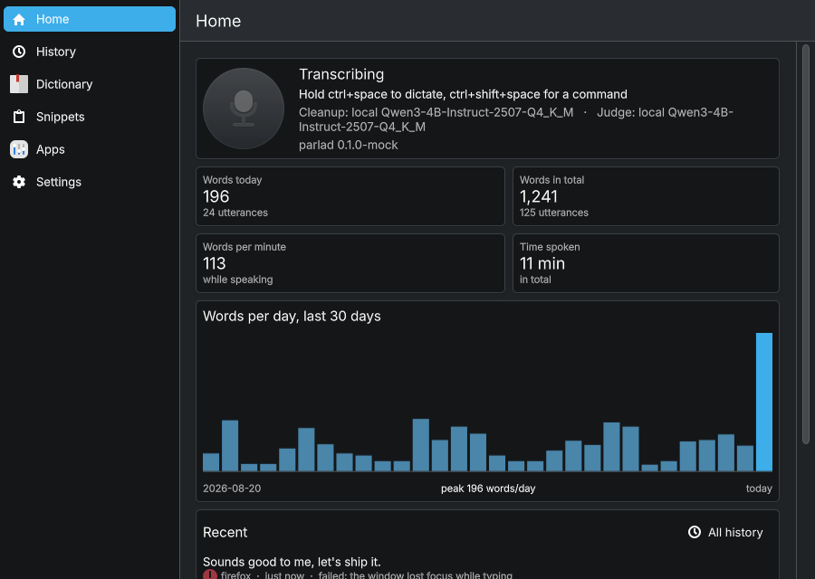

# parla

Hold a key, say what you want, and have it happen on a KDE Plasma desktop.

parla captures speech locally and transcribes it with whisper.cpp on the
GPU. Nothing leaves the machine. A small instruct model on the same GPU
cleans up dictation for the application it lands in, applies spoken edits
like "make that shorter", and reads the intent of commands the grammar
cannot parse. Sending either job to a cloud API instead is one line of
config. A Kirigami UI shows what the daemon is doing and holds the
history, the dictionary, the snippets and the per-app profiles.

## How an utterance travels

```
hotkey held → PipeWire capture → Silero VAD → whisper.cpp → router → executor
                                  (trim, reject)  (CUDA)         │
                                                    dictation ───┼─ snippets, dictionary, cleanup → typed
                                                    command  ────┼─ grammar      in-process
                                                                 ├─ judged path  local GGUF, or API
                                                                 └─ refuse
```

Two hotkeys, both push-to-talk. `Ctrl+Space` dictates: the transcript is
typed into whatever has focus, cleaned up for the application it lands in.
`Ctrl+Shift+Space` commands: the router turns the transcript into an
action. The UI's overlay does the same with a click, for hands-free use.

The router tries the cheap path first. A grammar of literal patterns
matches `open firefox` or `desktop two` without leaving the process.
Anything phrased outside those patterns goes to the judged path, which asks
a model for the intent and its arguments in one evaluation. By default that
model is a 4B instruct GGUF running through llama.cpp on the GPU. What
neither path can resolve, parla refuses out loud instead of guessing.

Either path ends in the same policy. Closing a window, firing a shortcut,
sending a key chord or messaging Claude Code always ask first, whatever the
model's confidence, and the question names the resolved target: "Close
'build — Konsole'? say yes". A yes is honoured for eight seconds and only
if that window still exists.

## Dictation

Whisper writes what it heard, fillers and all. Before the transcript is
typed, a snippet can replace the whole utterance ("my email"), the
dictionary fixes the names whisper gets wrong and primes it for next time,
and the cleanup model rewrites the rest: fillers and false starts go, a
self-correction keeps its final version ("send it Monday, no, Tuesday"
becomes "send it Tuesday"), spoken punctuation becomes punctuation, and an
enumeration becomes a list. The prompt forbids adding, answering or
translating, and parla checks what comes back. If it is empty or
suspiciously long, the raw transcript is typed instead.

How the text should read depends on where it lands. A profile per window
class picks a tone: `code` for terminals and editors turns "dash" into `-`
and adds no trailing period, `casual` for chat keeps contractions and
invents no sign-offs, `formal` for mail writes complete sentences and
paragraphs. Profiles carry free-text instructions on top.

When the application exposes its text field over the accessibility bus,
as Qt, GTK, Firefox and Chromium do, the model is also shown the text
before the cursor and told to continue it in the same language, register
and capitalisation.

For a while after a dictation, the command hotkey takes it back: "scratch
that" deletes it, and "make that more formal", "shorter" or "turn that
into bullet points" rewrite it in place. Before deleting, parla reads the
field again and checks the dictation is still at the end of it, allowing
for an autocorrected word; a field that has changed is left alone. parla
also notices a word you fix by hand after dictating it ("Emanuel" to
"Emanuele") and offers it for the dictionary, or adds it on the second
time if the config says so.

```
parlad --flow "um so send it monday no tuesday" org.kde.konsole
```

prints what would be typed for a window class, without typing it. On an
RTX 5060 a sentence comes back in well under a second.

## Commands

```
parlad --judge "bring the file manager to the front"
```

runs one utterance against the live desktop and prints which path took it,
what the model answered, and whether the policy would act, ask or refuse.

The judge sends one request with the utterance and the state code already
knows: which applications are installed, which windows are open, how many
desktops exist. Candidates come from that state, so the model cannot name
a target that does not exist. Whether something already runs comes from
the window list, not from the model. A message for Claude Code is copied
from the utterance, never rewritten.

The local model never generates text for the judge. Every question has a
closed set of answers, and each option is scored by the probability the
model assigns to replying with exactly that key. `backend = "typesafe"`
under `[judge]` sends the same questions to the TypeSafe System One API
instead, with window titles kept on this machine unless allowed.

`parlad --calibrate corpus/judge.toml` runs a corpus of utterances through
the judge against a synthetic desktop and reports the accuracy and the
thresholds that score best. The policy's defaults for the local model
come from it.

## The UI




`parla-ui` is a Qt Quick and Kirigami application over the session bus.
An overlay pill at the bottom of the screen shows the microphone level
while parla listens, then the result or the confirmation question. A tray
icon follows the state. The main window has the history with search,
statistics, the dictionary, the snippets, the app profiles with a "try it"
box, and settings. The daemon runs without it.

`parla-mockd` is a stand-in daemon that serves the same bus interface with
made-up state, so the UI can be worked on without a microphone or a model.
The screenshots above come from it.

## Getting it running

```
cargo build --release
cargo build --release -p parla-ui        # needs Qt 6 and Kirigami
scripts/fetch-model.sh                   # whisper large-v3-turbo + Qwen3-4B, ~4 GB
parlad --print-default-config > ~/.config/parla/parla.toml
parlad --check
parlad
parla-ui
```

`--check` resolves the models, parses the config and the three editable
files, probes the injectors and counts windows, without registering a
hotkey or loading a model. The daemon needs Plasma 6, a CUDA toolchain,
`kdotool`, and `tmux` for the Claude Code intents. Typing goes through
KWin's EIS interface, or `ydotool` when that probe fails.

The full walk-through, with a systemd user unit and a troubleshooting
list, is in [docs/getting-started.md](docs/getting-started.md).

## Documentation

| | |
| --- | --- |
| [Getting started](docs/getting-started.md) | Requirements, build, models, first run, autostart, what to do when something is off |
| [Configuration](docs/configuration.md) | Every key in `parla.toml`, the environment variables and the file locations |
| [Dictation](docs/dictation.md) | Snippets, the dictionary, app profiles and tones, the cleanup prompt, voice edits, history |
| [Commands](docs/commands.md) | The grammar and its rule file, the judged path, the policy, confirmation, what executes |
| [The bus interface](docs/dbus.md) | `org.parla.Daemon1`: states, properties, methods, signals, `busctl` examples |
| [The UI](docs/ui.md) | What each page does, the overlay and tray, autostart, how it is built |
| [Architecture](docs/architecture.md) | Crates, threads, the local model, safety rails, desktop integration, testing |

## Layout

| crate | what it holds |
| --- | --- |
| `parla-grammar` | Intents and the literal-pattern grammar, including the confirm/deny replies |
| `desktopd` | The executor and its `Command` vocabulary: windows, launching, the `.desktop` index, virtual desktops, tmux, text injection |
| `parla-flow` | Dictionary, snippets, app profiles and history: the files both the daemon and the UI read |
| `parlad` | The daemon: capture, Silero VAD, ASR, hotkeys, router, policy, confirmation, cleanup, judged path, session bus |
| `parla-ui` | The Kirigami UI: overlay, tray icon, history, dictionary, snippets, app profiles |

## Not done yet

- **The daemon and the UI have run together only against the mock.** The
  bus contract is tested end to end, but the first real session with both
  is still ahead.

## License

MIT. See [LICENSE](LICENSE).
